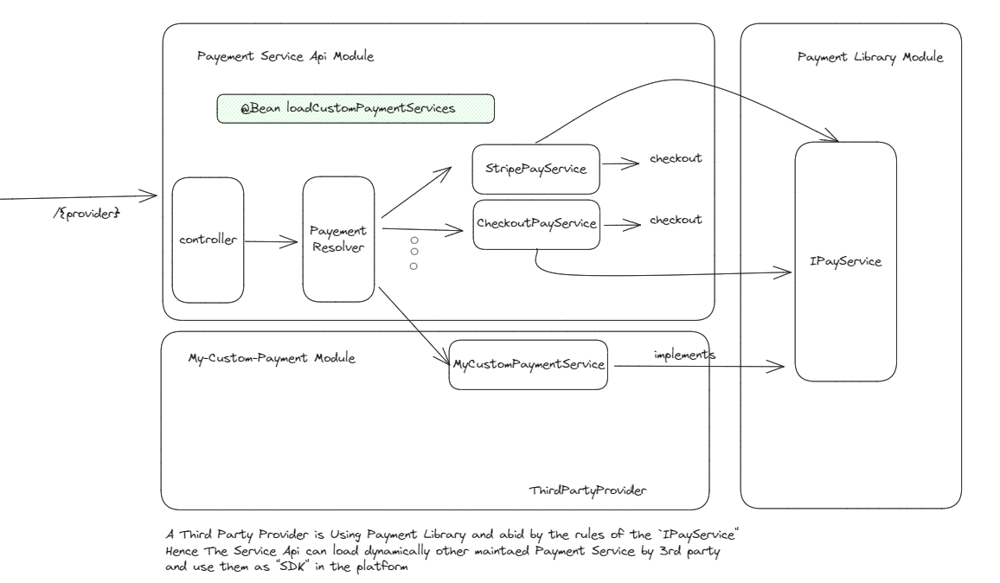

The `loadCustomPaymentServices` ideally should look into the class loader class path and check
if ths service api depends on a third party dependency that implements `IPayService`

However, since this 3rd party maintainer has its code as submodules and this repository its easy to locate it
but again the source code should will be not be the visible the purpose of this repository
is to show how you can dynamically loop over the classes that your service depends on and configure
beans dynamically

```java
  log.info("checking for payment services to load");
        String resourcePattern = createResourcePatternResolver();
        PathMatchingResourcePatternResolver resourcePatternResolver = new PathMatchingResourcePatternResolver();
        MetadataReaderFactory metadataReaderFactory = new CachingMetadataReaderFactory(resourcePatternResolver);
        Resource[] resources = resourcePatternResolver.getResources(resourcePattern);

        for (Resource resource : resources) {
            if (resource.isReadable()) {
                MetadataReader metadataReader = metadataReaderFactory.getMetadataReader(resource);
                String className = metadataReader.getClassMetadata().getClassName();
                Class<?> clazz = Class.forName(className);
                if (isAssignableToIPayService(clazz)) {
                    IPayService payService = (IPayService) clazz.getDeclaredConstructor().newInstance();
                    payServiceList.add(payService);
                }
            }
        }
```

The code above search in its submodules using regex matchers, and load the resources that matches.
if the resource is readable, you get its class type and if it is an implementation of the IPayService you create a instance of it
and you inject to the List that you already have from your service. Hence, you now have 3 implementations, 2 that comes from your source code
and another implementation from a 3rd party. 

Upon receiving a request, you can dynamically resolve which implementation to use depending on the provider name that comes from the api request